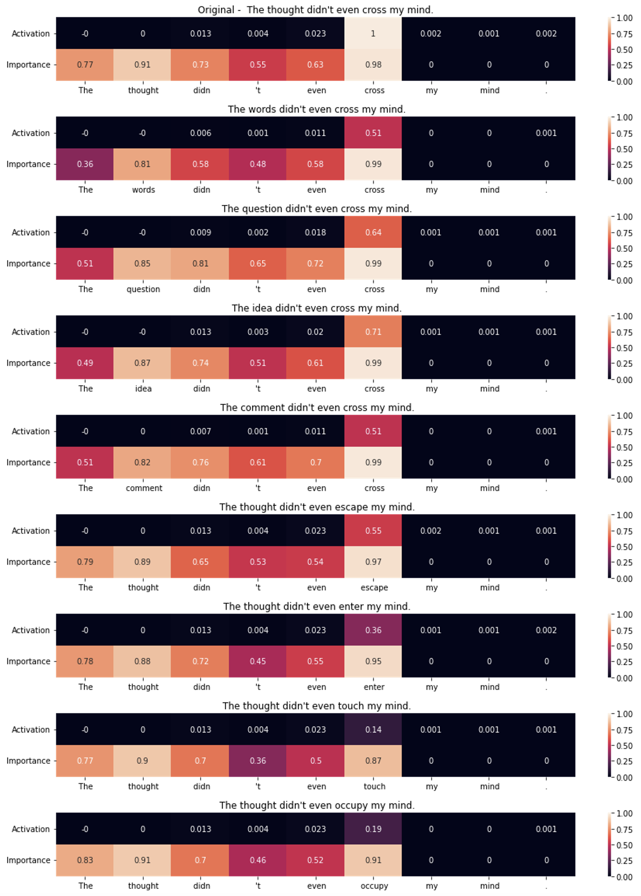

# Repository for Neuron to Graph: Interpreting Language Model Neurons at Scale

Authors: Alex Foote Neel Nanda, Esben Kran, Ionnis Konstas, Shay B. Cohen and Fazl Barez

Accepted at RTML workshop at ICLR 2023

Tools for exploring Transformer neuron behaviour, including input pruning and diversification, measuring token importance, and visualising the results.

See `Demo.ipynb` for a walkthrough of the method, and run it in Colab to try it yourself!

Description

Given a dataset example that is highly activating to a given neuron, the algorithm will prune it to the shortest string that is still highly activating, then generate new variations of that pruned prompt by substituting tokens using BERT. It can measure token importance by masking tokens and measuring the change in activation, and visualize token importance and relative neuron activation for a prompt.

For example, given an input like text #0 for [this neuron](https://lexoscope.io/solu-8l-old/3/1.html), the algorithm produces and visualizes a more diverse set of prompts, to give better insight into neuron behavior.



Installation and Running the Experiments

Follow these steps to install and run the N2G experiments:

Clone the repository:
   ```
   git clone https://github.com/username/N2G.git
   ```

Navigate to the project directory and set up a virtual environment: 

```
cd N2G
python -m venv venv
```

Activate the virtual environment:

```
source venv/bin/activate  # for Linux/Mac
venv\Scripts\activate  # for Windows

```

Install the required packages:

```
pip install -r requirements.txt
```

Run the `Demo.ipynb` notebook in Jupyter or Google Colab to try out the method:

```
jupyter notebook Demo.ipynb
```

To run the experiments, execute the following command:

```
python run_experiments.py
```

Citation

If you use N2G in your research, please cite our paper:

``` 

@inproceedings{foote2023n2g,   
title={N$2$G: A scalable approach for quantifying interpretable neuron representations in Large Language Models},   
author={Foote, Alex and Nanda, Neel and Kran, Esben and Konstas, Ionnis and Barez, Fazl},   
booktitle={RTML workshop ICLR},   
year={2023} 
} 

```
